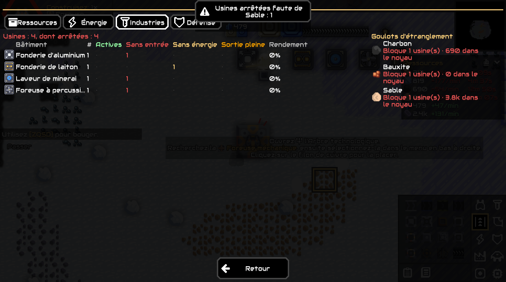

# MinClaude

Mod Java pour **Mindustry v160** (PC). Il suit les ressources dans le temps (graphiques, débits, prévisions, alertes), propose un dashboard de gestion et ajoute du contenu à Serpulo.

```bash
./gradlew check        # tous les tests (unitaires + jeu headless)
./gradlew play         # tests, déploiement dans ~/Library/Application Support/Mindustry/mods, lancement du jeu
```

| Document | Rôle |
|---|---|
| [CAHIER_DES_CHARGES.md](CAHIER_DES_CHARGES.md) | Besoin, issu de l'interview |
| [Etat.md](Etat.md) | État détaillé du projet : avancement, tests, limites |
| [ToDo.md](ToDo.md) | Prochaines tâches |
| [docs/PLAN.md](docs/PLAN.md) | Plan V0 → V4 découpé en artefacts |
| [docs/architecture/architecture.md](docs/architecture/architecture.md) | Architecture, flux de données, format de sauvegarde |
| [docs/guides/utilisation.md](docs/guides/utilisation.md) | Guide du joueur |
| [docs/guides/developpement.md](docs/guides/developpement.md) | Guide du développeur : build, tests, ajout de contenu |
| [docs/reference/modding-mindustry.md](docs/reference/modding-mindustry.md) | Référence de l'API de modding Mindustry v160.5 |
| [docs/images/](docs/images/) | Captures du jeu et planche des sprites |


