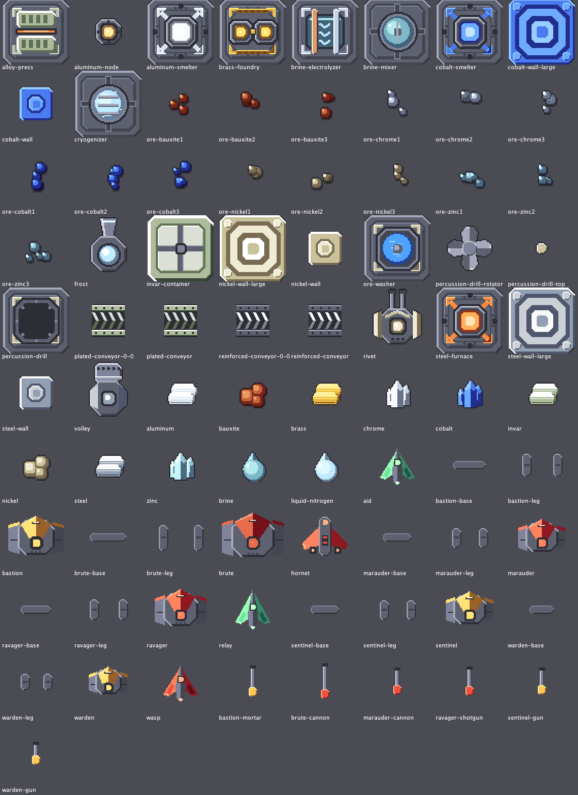

# Guide du joueur

## Installation

1. Copier `MinClaude.jar` dans le dossier des mods : sur macOS, `~/Library/Application Support/Mindustry/mods/`. On peut aussi passer par Mindustry > Mods > Importer un mod.
2. Relancer Mindustry. Il faut la version 160.4 ou plus récente.

## Suivi des ressources

### Mini-panneau (toujours visible)

À droite de l'écran, pendant une partie :

- les ressources du noyau, **les plus urgentes en premier** (épuisement le plus proche, puis plus forte baisse) ;
- pour chacune : quantité, **tendance nette par minute** (vert si elle monte, rouge si elle baisse), et, en rouge, le **temps avant épuisement** quand le stock baisse ;
- bouton 📊 : ouvre le dashboard ; bouton ▾ : replie ou déplie le panneau.

Une ressource apparaît dès qu'elle entre une première fois dans le noyau.

### Dashboard (touche `K`)

Quatre onglets, rafraîchis chaque seconde (même en pause) :

| Onglet | Contenu |
|---|---|
| **Ressources** | Liste des ressources suivies ; graphiques du stock et des entrées/sorties ; plages 1 min, 10 min, 1 h ou toute la partie ; stock / capacité, entrées, sorties, tendance nette, « épuisé dans », « plein dans » ; **production installée** (ce que vos usines produiraient à plein régime) et part utilisée, **demande installée** ; **objectif de stock** (bouton « Fixer un objectif » : progression, échéance, alerte une fois atteint) ; nombre d'usines bloquées faute de cette ressource |
| **Énergie** | Production et consommation dans le temps, énergie stockée et capacité des batteries, solde, part de la demande couverte, nombre de réseaux |
| **Industries** | Chaque type d'usine (fonderies, foreuses, séparateurs…) : nombre, actives, sans entrée, sans énergie, sortie pleine, rendement ; à droite, les **goulots d'étranglement**, c'est-à-dire les ressources qui bloquent le plus d'usines, avec leur stock |
| **Défense** | Vague actuelle, temps avant la suivante, ennemis en vie, composition de la prochaine vague ; tourelles (total, sans munitions, endommagées) ; unités alliées par type |

L'historique est **enregistré dans la sauvegarde** : on le retrouve en rechargeant la partie. Le temps est celui du jeu : rien n'est enregistré pendant la pause.

> Les entrées et sorties sont estimées à partir des variations du stock. Si une ressource entre et sort pendant la même fraction de seconde, ces mouvements se compensent. La tendance nette, elle, est exacte.

### Alertes

Des messages s'affichent en haut de l'écran quand :

- **une ressource va s'épuiser** avant le délai choisi (3 min par défaut) ;
- **une ressource passe sous le seuil bas** (5 % de la capacité par défaut), seulement si elle a déjà été abondante ;
- **le noyau est plein** d'une ressource qui continue d'arriver : ce surplus est perdu.

- **des usines sont arrêtées** faute d'une ressource ;
- **l'énergie manque** : moins de 75 % de la demande est couverte ;
- **des tourelles n'ont plus de munitions** ;
- **un objectif de stock est atteint**. Il est réarmé si le stock repasse sous 90 % de l'objectif.

Une même alerte ne se répète pas tant que la situation dure. Après un retour à la normale, elle ne peut revenir qu'au bout de 2 minutes.

## Options (Paramètres > MinClaude)

| Option | Défaut | Effet |
|---|---|---|
| Afficher le panneau des ressources | oui | Affiche ou masque les lignes du mini-panneau |
| Ressources dans le panneau | 6 | Nombre de lignes |
| Alertes de ressources | oui | Active les alertes |
| Seuil de stock bas | 5 % | En pourcentage de la capacité du noyau |
| Prévenir avant épuisement | 3 min | Délai de l'alerte d'épuisement |
| Difficulté | Normal | Facile : IA vanilla, ennemis du mod tardifs, ennemis à 75 % de PV. Normal → Brutal : IA de plus en plus agressive (rayon de recherche, escouades plus grandes, retraite à partir de Difficile), ennemis du mod plus tôt et plus nombreux, PV des ennemis ×1 / ×1,3 / ×1,7 et dégâts ×1 / ×1,15 / ×1,35. PV et dégâts sont fixés au début de la partie |
| IA ennemie intelligente | oui | Les ennemis (au sol et volants) visent les points faibles (générateurs, tourelles sans munitions, convoyeurs) au lieu du premier mur, et attaquent en escouades |
| Ajouter les ennemis MinClaude aux vagues | oui | Ajoute le maraudeur et la guêpe aux vagues des **nouvelles** parties |
| Générer les minerais MinClaude | oui | Ajoute des gisements de cobalt, nickel, zinc et bauxite aux **nouvelles** parties |

Le raccourci du dashboard se change dans Paramètres > Commandes > MinClaude.

## Contenu ajouté

### Ressources

| Ressource | Obtention | Usage |
|---|---|---|
| Cobalt | minerai (foreuse à percussion, niveau titane), fonderie de cobalt, laveur | murs en cobalt |
| Nickel | minerai, laveur | murs en nickel, riveteuse, foreuse à percussion, gardien |
| Zinc | minerai, laveur | laiton |
| Bauxite | minerai, laveur | aluminium |
| Aluminium | fonderie d'aluminium | convoyeur renforcé, nœud en aluminium, munition rapide, secours |
| Laiton | fonderie de laiton | munition perforante |

Les minerais apparaissent dans les **nouvelles parties** (cartes et secteurs de Serpulo), sur des cases libres, sans jamais remplacer un minerai vanilla. Ils sont aussi générés par défaut dans les cartes personnalisées de l'éditeur.

### Industries

| Bâtiment | Recette | Énergie | Déblocage |
|---|---|---|---|
| Fonderie de cobalt (2×2) | 2 plomb + 1 sable → 1 cobalt / s | 36/s | sous la fonderie de silicium |
| Fonderie d'aluminium (2×2) | 2 bauxite + 1 charbon → 1 aluminium / 0,83 s | 48/s | sous la fonderie de silicium |
| Fonderie de laiton (2×2) | 2 cuivre + 1 zinc → 2 laiton / 1,17 s | 30/s | sous la presse à graphite |
| Laveur de minerai (2×2) | 1 sable + eau → nickel, zinc, bauxite ou cobalt | 42/s | sous le séparateur |
| Foreuse à percussion (2×2) | niveau 3 (cobalt, titane), plus rapide que la pneumatique, accélérée par l'eau | 24/s | sous la foreuse pneumatique |

### Bâtiments

| Bâtiment | Caractéristiques | Déblocage |
|---|---|---|
| Mur en nickel / grand mur | 380 / 1520 PV, 6 / 24 nickel | sous le mur en cuivre |
| Mur en cobalt / grand mur | 520 / 2080 PV, 6 / 24 cobalt | sous le mur en titane |
| Convoyeur renforcé | 13 objets/s (titane : 10) | sous le convoyeur en titane |
| Riveteuse (tourelle 2×2) | munitions nickel (18), aluminium (12, tir rapide), laiton (26, perforant) ; portée 150 | sous le duo |
| Nœud en aluminium | portée 9, 12 liaisons, bon marché | sous le nœud électrique |

### Unités

| Unité | Camp | Description | Obtention |
|---|---|---|---|
| Gardien | allié | mécha terrestre robuste à deux canons, 320 PV | usine terrestre (15 silicium + 10 nickel) |
| Secours | allié | drone de soin, répare les unités proches | usine aérienne (15 silicium + 10 aluminium) |
| Maraudeur | ennemi | mécha blindé à canon explosif, 480 PV | vagues, à partir de la vague 13 en Normal |
| Guêpe | ennemi | volant rapide qui vise les générateurs | vagues, à partir de la vague 17 en Normal |

### Contenu V2

| Contenu | Type | Recette / caractéristiques | Déblocage |
|---|---|---|---|
| Chrome | ressource | minerai (niveau titane) ou électrolyse de la saumure | sous le titane |
| Acier | ressource | four à acier : 2 ferraille + 1 charbon → 1 acier / 1,25 s, 60 énergie/s | sous la ferraille |
| Invar | ressource | presse à alliage : 2 nickel + 1 acier → 2 invar / 1,5 s, 72 énergie/s | sous l'acier |
| Saumure | liquide | mélangeur de saumure : 1 sable + eau → saumure, 30 énergie/s | sous l'eau |
| Azote liquide | liquide | cryogénisateur : 1 aluminium + eau → azote, 90 énergie/s. Meilleur refroidissant que le cryofluide, gèle | sous l'eau |
| Électrolyseur | industrie 2×2 | saumure → 1 chrome / 1,33 s, 108 énergie/s | sous le mélangeur |
| Mur en acier / grand mur | défense | 640 / 2560 PV, absorbent les lasers | sous le mur en cobalt |
| Convoyeur blindé | logistique | 14,5 objets/s, n'accepte que les objets venant d'un convoyeur placé derrière lui | sous le convoyeur renforcé |
| Salve (2×2) | tourelle | fusil, 5 balles par tir ; acier (16) ou invar (22, recul) | sous la Riveteuse |
| Givre (2×2) | tourelle | projette un liquide ; l'azote liquide gèle et ralentit | sous la Vague |
| Conteneur en invar (2×2) | stockage | 450 objets, très solide, ne fusionne pas avec le noyau | sous le conteneur |
| Sentinelle / Bastion | alliés | mécha à rafales (650 PV) / mécha à mortier (1400 PV) | reconstructeurs additif / multiplicatif à partir du Gardien |
| Relais | allié | volant de soin, champ de réparation puissant | reconstructeur additif à partir du Secours |
| Ravageur | ennemi | mécha blindé à fusil, 950 PV | vagues, à partir de la vague 23 en Normal |
| Frelon | ennemi | bombardier, vise usines et générateurs | à partir de la vague 27 |
| Brute | ennemi (mini-boss) | 2600 PV, canon de siège ; rare | à partir de la vague 36, une vague sur 10 |

Les convoyeurs du mod ont maintenant leurs vraies formes de virage et de jonction.

### IA ennemie

Avec l'option « IA ennemie intelligente », les ennemis terrestres (vanilla et du mod) choisissent leur cible dans un rayon qui grandit avec la difficulté : 10 cases en Normal, 16 en Difficile, 24 en Brutal. Leur priorité : générateurs, puis tourelles sans munitions, nœuds électriques, usines, tourelles, convoyeurs, noyau. Les murs passent en dernier. Une cible proche ou presque détruite est préférée. Une unité bloquée par un mur abandonne sa cible quelques secondes et reprend le chemin normal vers le noyau. En Facile, ou sans l'option, le comportement reste celui du jeu de base.

Les **volants** (guêpe, frelon, flare, horizon…) utilisent la même notation dans un rayon 1,5 fois plus grand. Leurs cibles préférées de base, comme les générateurs pour la guêpe, restent prioritaires.

**Tactiques de groupe** (à partir de Normal) : chaque seconde, les ennemis au sol proches les uns des autres forment des escouades.

- Une escouade trop petite (3, 4 ou 5 unités selon la difficulté) **se regroupe** avant d'attaquer, au plus 10, 15 ou 20 s.
- À l'assaut, les unités des **ailes contournent** par les côtés de la ligne d'attaque, tandis que le centre avance directement.
- À partir de Difficile, une unité très abîmée **recule** quelques secondes derrière son escouade.
